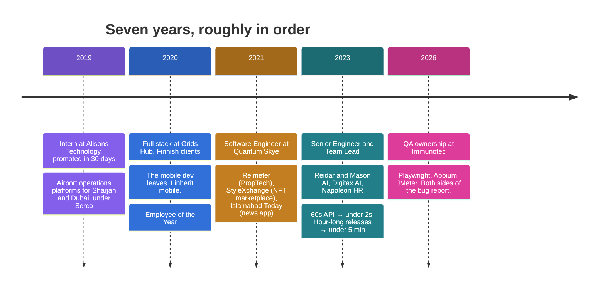
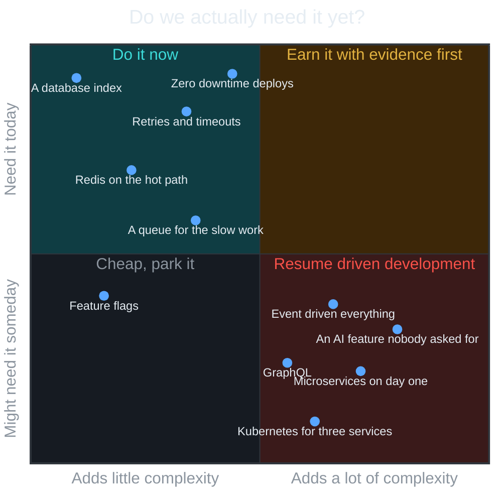
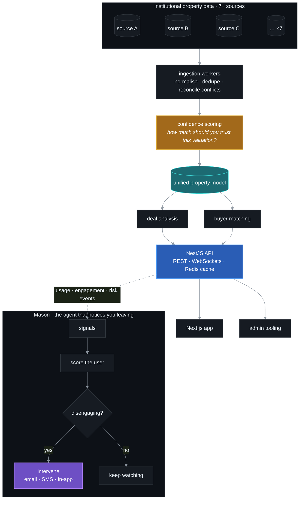
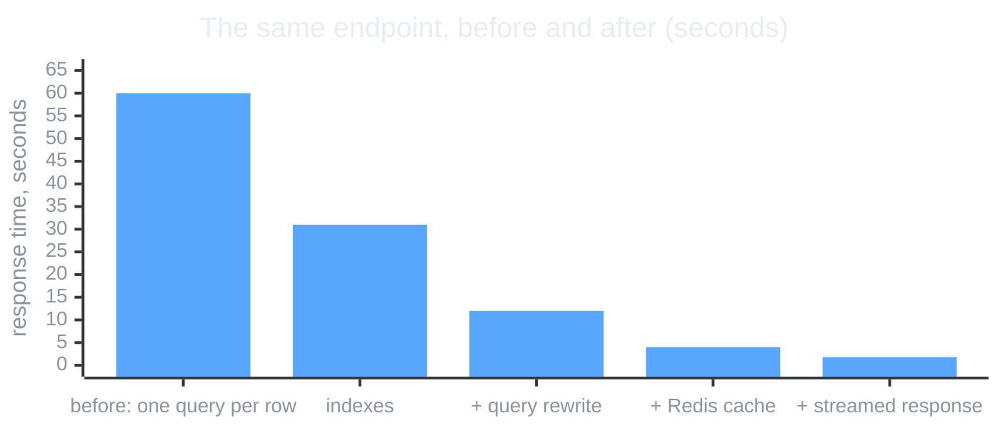
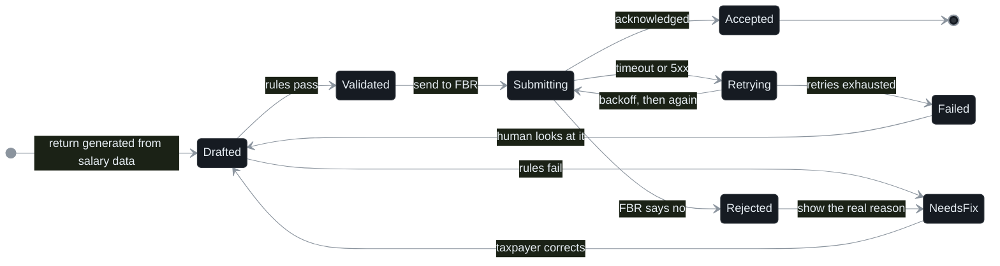
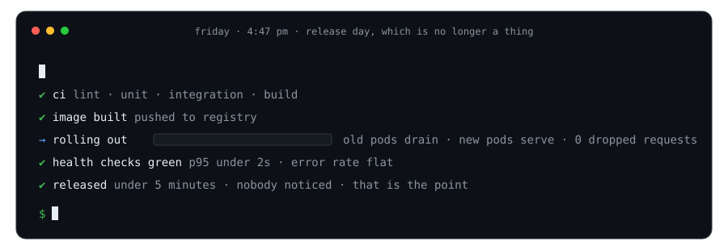
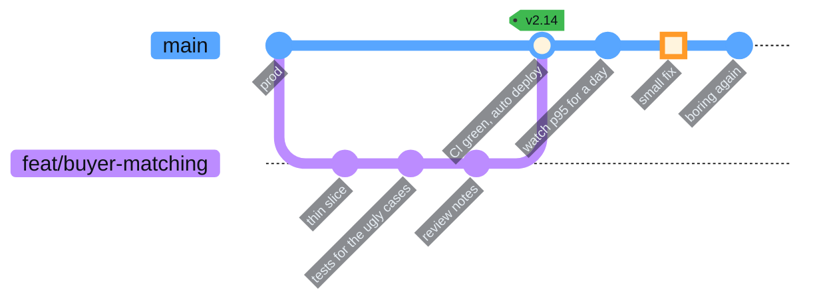

# Sherwin Samuel

**Senior Software Engineer · Tech Lead · Solution Architect**

 

&nbsp;

&nbsp;

Shipped for clients in &nbsp;:us: &nbsp;:de: &nbsp;:finland: &nbsp;:united_arab_emirates: &nbsp;:pakistan:

  

## The short version

I've been building production software since 2019. Seven years, five industries, a lot of 2 a.m. incidents.

Today I lead a team of four at **Quantum Skye**, owning architecture and delivery across two products end to end: requirements, system design, APIs, database performance, cloud infrastructure and the release itself. Since mid-2026 I also own QA for enterprise direct-selling platforms at **Immunotec**, which means I now spend part of my week trying to break the kind of thing I spend the rest of my week building.

I'm at my best when the problem is a bit uncomfortable. Data from seven sources that disagree with each other. An endpoint that takes a minute. A government API that returns errors nobody documented. A release process that only one person understands.

I like finding out what is *actually* happening, fixing that, and leaving the system simpler than I found it.

 

 

## How the story goes

**2019.** My first real job was an internship at Alisons Technology in Karachi. A month in, they made me a junior engineer and put me on ATMARS and ATLOG, the operations logging platforms for Sharjah and Dubai airports. Air traffic controllers used the screens I built to record what was happening on the ground. That's where I learned that a slow report isn't an inconvenience, it's an operational problem, and that the fix is usually an index and a better join, not a rewrite.

**2020.** At Grids Hub I was the primary developer from the Pakistan side for four Finnish client products. Then our only mobile developer left. Nobody else did mobile. I learned React Native from zero and had apps in both stores within months. I also built Dhobi Aya, the company's on-demand laundry startup, alone: customer app, rider app, admin panel, website. I got Employee of the Year, which I mostly attribute to saying yes to the mobile thing.

**2021.** Joined Quantum Skye. Built the first production version of Reimeter, an AI real estate deal analysis platform, including the ingestion layer that turned inconsistent third-party property data into one model. Built an NFT marketplace for a German client that had to stay usable when OpenSea was slow or down. Shipped a React Native news app solo, architecture through store release.

**2023.** Promoted to Senior Engineer and Team Lead. Reimeter became Reidar. I designed the core platform, a pipeline consolidating property data from seven-plus institutional sources with confidence scoring, and Mason, an in-product agent that watches usage and risk signals and intervenes before a user churns. On the side: Digitax, direct integration with Pakistan's tax authority for end-to-end e-filing, and Napoleon, an HR platform with AI-assisted candidate evaluation.

**2026.** Took on QA ownership at Immunotec for platforms built on Exigo: commissions, checkout, enrollment, genealogy. Playwright for web, Appium for mobile, JMeter for load. After years of being the engineer whose code got tested, being the person writing the tests has changed how I design APIs. Every error path I used to skip is now a test case I have to write.

## How I approach a problem

I don't have a favourite architecture I try to fit every project into. I have a loop.

The questions I actually ask in the first meeting:

- **Who is waiting on this, and what happens if it's late?** A tax return and a news feed have very different failure budgets.
- **What data do we trust, and how much?** On Reidar, seven sources disagreed about the same house. The answer wasn't picking one. It was a confidence score that told the user how much to trust the number.
- **What already exists that we're replacing?** The airport systems replaced paper and spreadsheets. The first version had to be at least as easy as the spreadsheet or nobody would use it.
- **What will change in six months?** Not to build for it now, but to avoid painting ourselves into a corner.
- **How will we know it's broken before the customer tells us?**

And the chart I mentally consult before adding anything to a system:

Good engineering is mostly knowing when you don't need something.

## Two systems, drawn honestly

### Reidar and Mason: property data from seven sources into one answer

The hard part of PropTech isn't the UI. It's that every data source describes the same property slightly differently, and some of them are wrong.

The API in that diagram is the one that used to take about a minute. It now responds in under two seconds. Nothing was rewritten. I profiled it, fixed the queries, added the indexes that should have been there, cached the expensive lookups in Redis and streamed the response instead of buffering it.

The intermediate bars are from memory rather than a saved benchmark. The first and last are the ones I'd put my name on.

### Digitax: filing a tax return with an API that doesn't always answer

Every state in this diagram exists because it happened in production at least once.

The happy path is one line. The other eleven are the job. A failed submission here is a real person with a real deadline, so "it errored" was never an acceptable end state.

## What shipping looks like

Release day used to be an hour of one person carefully doing things in the right order. Now it's this:

I enjoy the whole path: `idea → architecture → code → tests → deploy → production → 2 a.m. → improvement`. The last two are where the interesting stuff lives.

## Toolbox

The stack changes per project. These are the ones I've shipped with, not the ones I've read about.

<table align="center">
<tr>
<td align="right"><b>backend</b></td>
<td></td>
</tr>
<tr>
<td align="right"><b>frontend & mobile</b></td>
<td></td>
</tr>
<tr>
<td align="right"><b>data</b></td>
<td></td>
</tr>
<tr>
<td align="right"><b>cloud & delivery</b></td>
<td></td>
</tr>
<tr>
<td align="right"><b>quality</b></td>
<td>&nbsp;

</td>
</tr>
</table>

Also MSSQL, WebSockets, serverless, queues, event-driven processing, and the Android and iOS build, signing and store-release pipeline, which is a skill in the way that filing taxes is a skill.

## Leading, briefly

I lead four engineers and stay hands-on: architecture, code review, requirements, QA, delivery, and whatever is on fire. I've run 15+ technical interviews and spend a lot of time mentoring.

The part I enjoy most is watching someone go from

> "I don't know how to solve this."

to

> "I know how to *approach* this."

Fixing it for them is faster today and slower forever.

## A few opinions, held loosely

- Simple systems are underrated. Boring is a feature.
- A database index can be more exciting than a new framework. It was, five times.
- If everything is a microservice, nothing is simple.
- The best abstraction is the one the next engineer understands without a call.
- Shipping teaches you things architecture diagrams can't. Including that your diagram was wrong.
- The person testing your API should be able to break it. If they can't, they aren't trying.

## Currently curious about

`agentic systems that earn their keep` · `event-driven architecture` · `distributed systems` · `developer experience` · `performance` · `testing that actually catches things`

Especially the places where these overlap.

<picture>
  <source media="(prefers-color-scheme: dark)" srcset="https://raw.githubusercontent.com/Webtech12/Webtech12/output/github-snake-dark.svg"/>
  <source media="(prefers-color-scheme: light)" srcset="https://raw.githubusercontent.com/Webtech12/Webtech12/output/github-snake.svg"/>
  
</picture>

most of my commits live in private repos. the snake makes do.

  

## Let's build something useful

If you're working on an interesting engineering problem, an ambitious product, or a system currently doing something it absolutely should not be doing:

&nbsp;

  

Build something useful. Then make it better.

