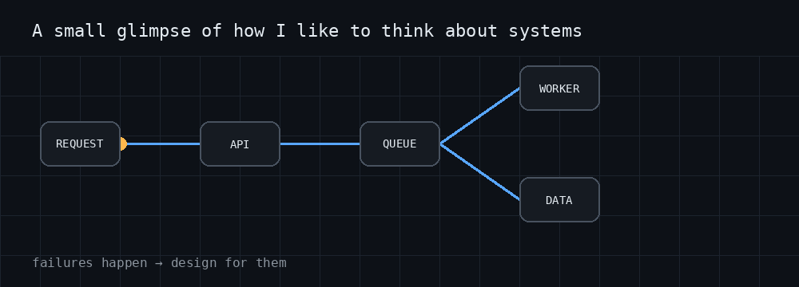
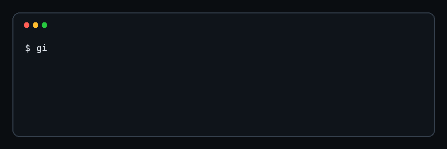

<div align="center">

# 👋 Hey, I'm Sherwin

### Senior Software Engineer · Technical Lead · AI & Platform Engineering

**I like turning complicated problems into software that works.**

<br/>

<a href="https://www.linkedin.com/in/sherwin-samuel-a9a8941a1/">

</a>
<a href="mailto:sherwinlukes@gmail.com">

</a>

<br/><br/>


</div>

---

## 👋 The short version

I've been building production software since 2019.

These days I work across **backend engineering, architecture, cloud, AI and technical leadership**. I've built systems in PropTech, FinTech, SaaS, mobile and enterprise environments.

I'm happiest when the problem is slightly uncomfortable:

**messy data · slow APIs · unreliable integrations · complicated workflows · systems that need to scale**

I like getting into the details, figuring out what is actually happening, and leaving the system better than I found it.

---

## ⚡ I like this kind of work

<div align="center">

**🤖 AI** &nbsp; **⚙️ Backend** &nbsp; **☁️ Cloud** &nbsp; **📊 Data** &nbsp; **🧪 Testing** &nbsp; **🚀 Delivery**

</div>

<br/>

<div align="center">



</div>

---

## 🔥 Things I care about

<table>
<tr>
<td width="50%">

### Measure first

I've taken an API from roughly **60 seconds to under 2 seconds**.

The answer wasn't a magic framework.

It was finding the bottleneck and fixing the database queries, indexes, caching and response path.

</td>
<td width="50%">

### Make shipping boring

I've replaced manual, hour-long release processes with **CI/CD and zero-downtime deployments**, bringing releases down to **under 5 minutes**.

If release day feels like an event, I'd like to fix that.

</td>
</tr>
<tr>
<td>

### Design for failure

External APIs fail.

Queues back up.

Data gets weird.

Users find edge cases.

Production is not the happy path, so systems shouldn't be designed like it is.

</td>
<td>

### Keep it understandable

I like architecture that another engineer can pick up, reason about and change without needing a guided tour from the person who built it.

</td>
</tr>
</table>

---

## 🧰 My toolbox

<div align="center">


</div>

---

## 🧩 A few areas I've worked in

**🏠 PropTech** — property data, deal analysis, matching, ingestion pipelines and real-time workflows.

**🤖 AI / SaaS** — agentic product features, behavioural scoring and automated interventions.

**🧾 FinTech** — compliance-heavy workflows, government integrations and e-filing.

**📱 Mobile** — React Native apps across iOS and Android, including maps, routing and third-party services.

**✈️ Enterprise** — operational systems replacing disconnected, manual processes.

That's enough project history for a README.

If you want the full story, that's what the code and LinkedIn are for.

---

## 🚀 Shipping > talking about shipping

<div align="center">



</div>

I enjoy the whole path:

`idea → architecture → code → tests → deployment → production → debugging → improvement`

The last two steps are usually where the interesting stuff happens.

---

## 🧠 How I make engineering decisions

I don't have a favourite architecture that I try to force onto every project.

I ask:

```text
What are we actually solving?
          ↓
What are the constraints?
          ↓
What will change as we scale?
          ↓
What is the simplest design that works?
          ↓
How will we know when it breaks?
          ↓
Ship.
```

Not every application needs microservices.

Not every API needs GraphQL.

Not every workflow needs a queue.

Not every product needs AI.

**Good engineering is mostly knowing when you don't need something.**

---

## 🤝 Engineering + leadership

I currently lead a team of engineers while staying hands-on with architecture, code reviews, requirements, QA, delivery and production problems.

I've conducted 15+ technical interviews and spend a lot of time mentoring engineers.

The part of leadership I enjoy most is helping someone go from:

> "I don't know how to solve this."

to:

> "I know how to approach this."

That's a much better outcome than simply fixing it for them.

---

## 🔭 Currently curious about

`Agentic AI`

`Distributed systems`

`Event-driven architecture`

`Developer experience`

`Performance`

`Cloud infrastructure`

`Better testing`

Especially the places where these things overlap.

---

## 💭 A few opinions

> **Simple systems are underrated.**

> **A database index can be more exciting than a new framework.**

> **If everything is a microservice, nothing is simple.**

> **The best abstraction is the one the next engineer understands.**

> **Shipping teaches you things architecture diagrams can't.**

---

<div align="center">

## Let's build something useful.

If you're working on an interesting engineering problem, an ambitious product, or a system currently doing something it absolutely should not be doing —

**say hello.**

<br/>

<a href="mailto:sherwinlukes@gmail.com">

</a>
<a href="https://www.linkedin.com/in/sherwin-samuel-a9a8941a1/">

</a>

<br/><br/>

<sub>Build something useful. Then make it better.</sub>

</div>
