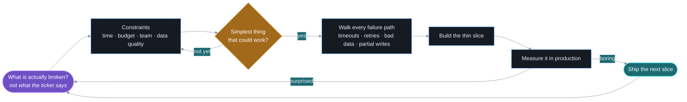
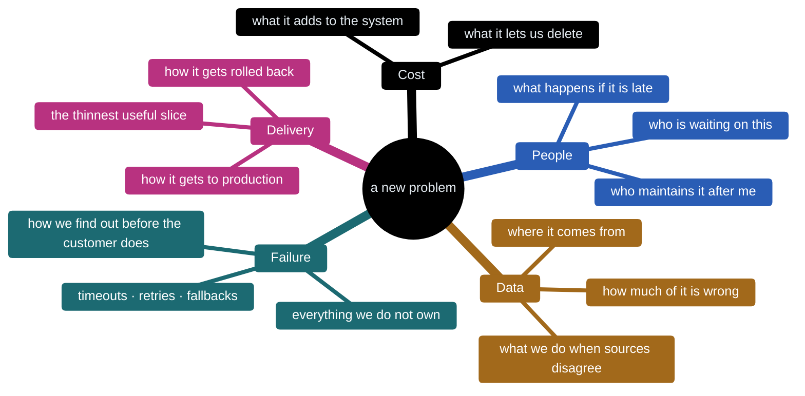
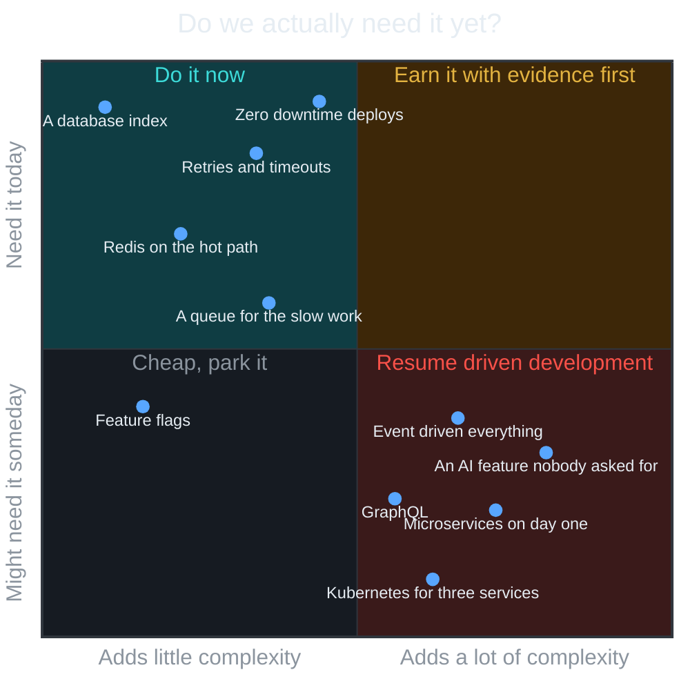
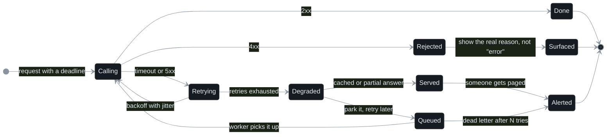
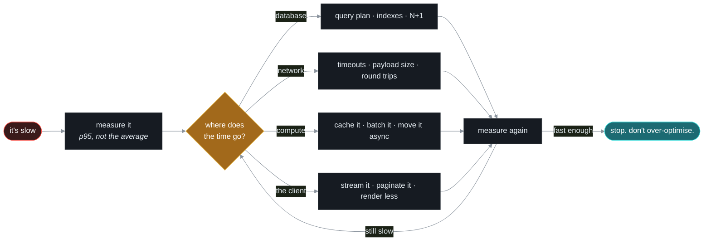
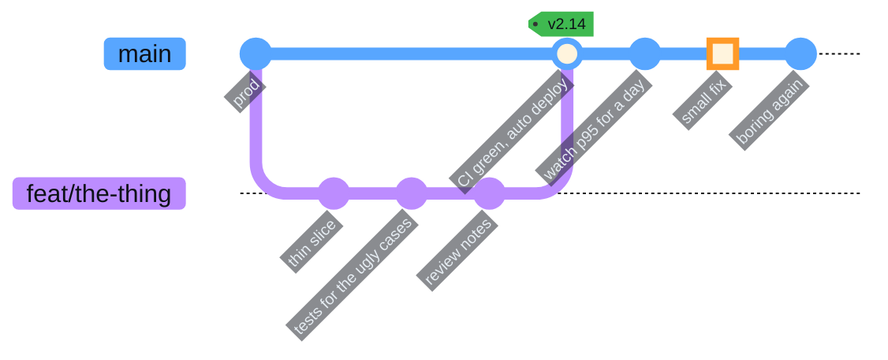

# Sherwin Samuel

**Senior Software Engineer · Tech Lead · Solution Architect**

 

&nbsp;

&nbsp;

Shipped for teams in &nbsp;:us: &nbsp;:de: &nbsp;:finland: &nbsp;:united_arab_emirates: &nbsp;:pakistan:

  

## The short version

I've been building production software since 2019. Seven years, five industries, a lot of 2 a.m. incidents.

I lead a small team and own architecture and delivery end to end: requirements, system design, APIs, database performance, cloud infrastructure and the release itself. I also own QA on a separate platform, which means I spend part of my week trying to break the kind of thing I spend the rest of my week building. Both halves make the other one better.

I'm at my best when the problem is a bit uncomfortable. Data sources that disagree with each other. An endpoint that takes a minute. A third-party API that returns errors nobody documented. A release process only one person understands.

I like finding out what is *actually* happening, fixing that, and leaving the system simpler than I found it.

 

 

## How I approach a problem

I don't have a favourite architecture I try to fit every project into. I have a loop.

Before I draw a single box, this is what I'm actually looking at:

The questions I actually ask in the first meeting:

- **Who is waiting on this, and what happens if it's late?** A tax return and a news feed have very different failure budgets.
- **What data do we trust, and how much?** When two sources disagree about the same record, the answer usually isn't picking one. It's telling the user how confident we are.
- **What already exists that we're replacing?** If the first version isn't at least as easy as the spreadsheet it replaces, nobody will use it.
- **What will change in six months?** Not to build for it now, but to avoid painting ourselves into a corner.
- **How will we know it's broken before the customer tells us?**

And the chart I mentally consult before adding anything to a system:

Good engineering is mostly knowing when you don't need something.

## Design for the day it breaks

External APIs fail. Queues back up. Data gets weird. Users find edge cases. Production is not the happy path, so I don't design as if it is.

Here's how I treat every call to something I don't own. The happy path is one line. The rest is the job.

The rules behind it:

- **Every call has a timeout.** No exceptions. A call without one is a call that can hang forever.
- **Retries have backoff and a ceiling.** Retrying instantly turns a hiccup into an outage.
- **Degraded beats down.** A cached answer, a partial page or a "we'll email you" is almost always better than a spinner.
- **The user sees the real reason.** "Something went wrong" is a bug report waiting to happen.
- **Someone finds out.** If a failure path ends without a metric or an alert, it's not finished.

## Measure first

I've taken an endpoint from about a minute down to under two seconds. The fix wasn't a new framework or a rewrite. It was profiling it, fixing the queries, adding the indexes that should have been there, caching the expensive lookups and streaming the response instead of buffering it.

That's the pattern nearly every time. The slow thing is rarely the thing people assume is slow.

## Make shipping boring

Release day used to be an hour of one person carefully doing things in the right order. I've replaced that with CI and zero-downtime deploys that take under five minutes. Now it looks like this:

I enjoy the whole path: `idea → architecture → code → tests → deploy → production → 2 a.m. → improvement`. The last two are where the interesting stuff lives.

## Toolbox

The stack changes per project. These are the ones I've shipped with, not the ones I've read about.

<table align="center">
<tr>
<td align="right"><b>backend</b></td>
<td></td>
</tr>
<tr>
<td align="right"><b>frontend & mobile</b></td>
<td></td>
</tr>
<tr>
<td align="right"><b>data</b></td>
<td></td>
</tr>
<tr>
<td align="right"><b>cloud & delivery</b></td>
<td></td>
</tr>
<tr>
<td align="right"><b>quality</b></td>
<td>&nbsp;

</td>
</tr>
</table>

Also MSSQL, WebSockets, serverless, queues, event-driven processing, and the Android and iOS build, signing and store-release pipeline, which is a skill in the way that filing taxes is a skill.

## Building it and breaking it

For years I was the engineer whose code got tested. Now I also write the tests: Playwright for web, Appium for mobile, JMeter for load, and the kind of API tests that send the wrong thing on purpose.

It changed how I design. Every error path I used to skip is now a test case I have to write, so I stopped skipping them.

## Leading, briefly

I lead a small team and stay hands-on: architecture, code review, requirements, QA, delivery, and whatever is on fire. I've run 15+ technical interviews and spend a lot of time mentoring.

The part I enjoy most is watching someone go from

> "I don't know how to solve this."

to

> "I know how to *approach* this."

Fixing it for them is faster today and slower forever.

## A few opinions, held loosely

- Simple systems are underrated. Boring is a feature.
- A database index can be more exciting than a new framework. It was, five times.
- If everything is a microservice, nothing is simple.
- The best abstraction is the one the next engineer understands without a call.
- Shipping teaches you things architecture diagrams can't. Including that your diagram was wrong.
- The person testing your API should be able to break it. If they can't, they aren't trying.

## Currently curious about

`agentic systems that earn their keep` · `event-driven architecture` · `distributed systems` · `developer experience` · `performance` · `testing that actually catches things`

Especially the places where these overlap.

<picture>
  <source media="(prefers-color-scheme: dark)" srcset="https://raw.githubusercontent.com/Webtech12/Webtech12/output/github-snake-dark.svg"/>
  <source media="(prefers-color-scheme: light)" srcset="https://raw.githubusercontent.com/Webtech12/Webtech12/output/github-snake.svg"/>
  
</picture>

most of my commits live in private repos. the snake makes do.

  

## Let's build something useful

If you're working on an interesting engineering problem, an ambitious product, or a system currently doing something it absolutely should not be doing:

&nbsp;

  

Build something useful. Then make it better.

